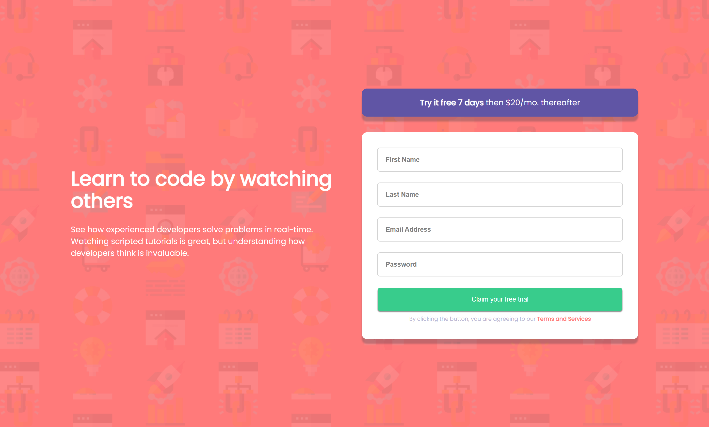

# Frontend Mentor - Intro component with sign up form solution

### Screenshot



### Links

- Solution URL: [Github](https://github.com/Jemi-code/IntroComponent)
- Live Site URL: [Live Site](https://jemi-code.github.io/IntroComponent)

## My process

### Built with

- Semantic HTML5 markup
- CSS custom properties
- Flexbox
- Vanilla Javascript
- Mobile-first workflow

### What I learned

```css
 header p{
            padding: 1rem 2rem;
            background-color: hsl(248, 32%, 49%);
            border-radius: 2rem;
            transition-property: all;
            transition-duration: 0.5s;
            transition-timing-function: ease-in;
            transform: rotateY(180deg);
        }

        p:hover{
            transform: rotateY(0deg);
            cursor: pointer;
        }
```
```js
let makeDefault = () => {
    firstName.style.outline = "1px solid lightgray";
    lastName.style.outline = "1px solid lightgray";
    email.style.outline = "1px solid lightgray";
    password.style.outline = "1px solid lightgray";

    firstName.style.color = "hsl(249, 10%, 26%)";
    lastName.style.color = "hsl(249, 10%, 26%)";
    email.style.color = "hsl(249, 10%, 26%)";
    password.style.color = "hsl(249, 10%, 26%)";

    firstName.style.marginBottom = "1.5rem";
    lastName.style.marginBottom = "1.5rem";
    email.style.marginBottom = "1.5rem";
    password.style.marginBottom = "1.5rem";

    for(let i = 0; i < error.length; i++){
        error[i].style.display = "none";
    }
}
```

- Frontend Mentor - [@Jemi-code](https://www.frontendmentor.io/profile/Jemi-code)